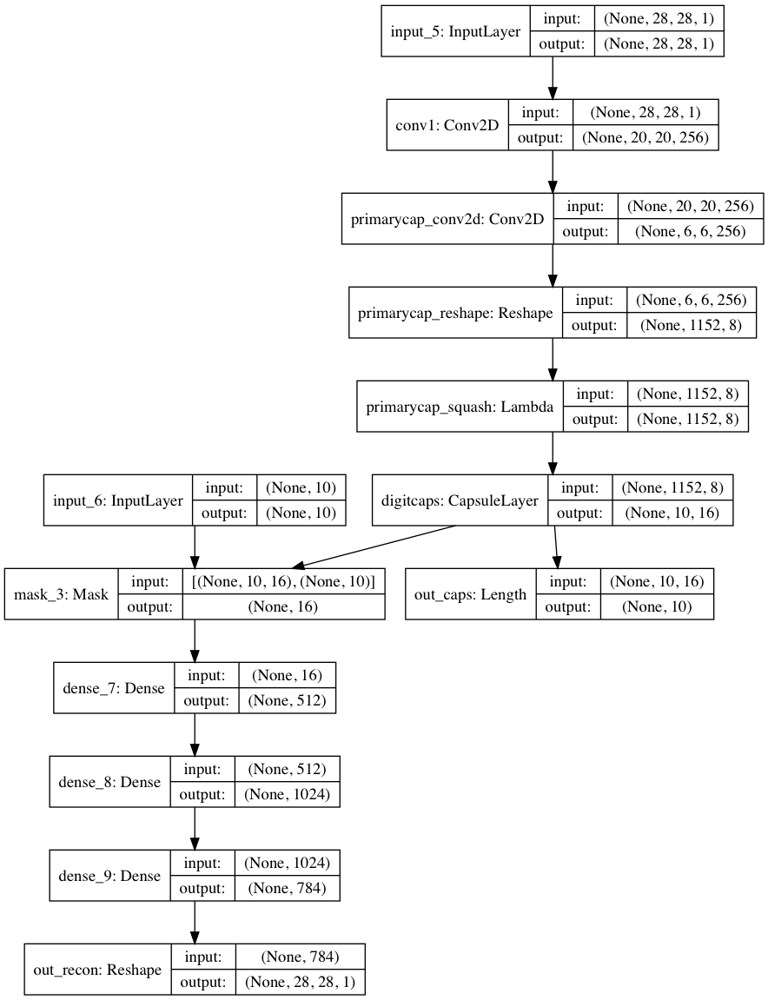

# CapsNet-Keras
[](https://github.com/XifengGuo/CapsNet-Keras/blob/master/LICENSE)

Now `test error < 0.4%`. A Keras implementation of CapsNet in the paper:   
[Sara Sabour, Nicholas Frosst, Geoffrey E Hinton. Dynamic Routing Between Capsules. NIPS 2017](https://arxiv.org/abs/1710.09829)

**Differences with the paper:**   
- We use the learning rate decay with `decay factor = 0.9` and `step = 1 epoch`,    
while the paper did not give the detailed parameters.
- We only report the test errors after `30 epochs` training (still under-fitting).   
In the paper, I suppose they trained for `1250 epochs` according to Figure A.1?
- We use MSE (mean squared error) as the reconstruction loss and 
the coefficient for the loss is `lam_recon=0.0005*784=0.392`.   
This should be **equivalent** with using SSE (sum squared error) and `lam_recon=0.0005` as in the paper.

**Recent updates:**
- Change the default value of lam_recon from 0.0005 to 0.392. This is because the reconstruction
loss is SSE in paper but MSE in our implementation. 
We believe that MSE is more robust to the dimension of input images.
- Report test errors on MNIST

**TODO**
- ~~The model has 8M parameters, while the paper said it should be 11M.~~   
I have figured out the reason: 11M parameters are for the CapsuleNet on MultiMNIST where the
image size is 36x36. The CapsuleNet on MNIST should indeed have 8M parameters. 
- I'll stop pursuing higher accuracy on MNIST. 
It is time to explore the interacting characteristics of CapsuleNet.

**Contacts**
- Your contributions to the repo are always welcome. 
Open an issue or contact me with E-mail `guoxifeng1990@163.com` or WeChat `wenlong-guo`.

***iPython Notebook**
Claude Coulombe, PhD candidate TELUQ / UQAM tested the code and
added a simple iPython Notebook `CapsNet_in_Keras_TensorFlow_Notebook.ipynb` to the project.

## Usage

**Step 1.
Install [Keras](https://github.com/fchollet/keras) 
with [TensorFlow](https://github.com/tensorflow/tensorflow) backend.**
```
pip install tensorflow-gpu
pip install keras
```

**Step 2. Clone this repository to local.**
```
git clone https://github.com/XifengGuo/CapsNet-Keras.git
cd CapsNet-Keras
```

**Step 3. Train a CapsNet on MNIST**  

Training with default settings:
```
$ python capsulenet.py
```
Training with one routing iteration (default 3).   
```
$ python capsulenet.py --num_routing 1
```

Other parameters include `batch_size, epochs, lam_recon, shift_fraction, save_dir` can be
passed to the function in the same way. Please refer to `capsulenet.py`

**Step 4. Test a pre-trained CapsNet model**

Suppose you have trained a model using the above command, then the trained model will be
saved to `result/trained_model.h5`. Now just launch the following command to get test results.
```
$ python capsulenet.py --is_training 0 --weights result/trained_model.h5
```
It will output the testing accuracy and show the reconstructed images.
The testing data is same as the validation data. It will be easy to test on new data, 
just change the code as you want.

You can also just *download a model I trained* from https://pan.baidu.com/s/1o7Hb9fO

## Results

**Test Errors**   

CapsNet classification test **error** on MNIST. Average and standard deviation results are
reported by 3 trials. The results can be reproduced by launching the following commands.   
 ```
 python capsulenet.py --num_routing 1 --lam_recon 0.0    #CapsNet-v1   
 python capsulenet.py --num_routing 1 --lam_recon 0.392  #CapsNet-v2
 python capsulenet.py --num_routing 3 --lam_recon 0.0    #CapsNet-v3 
 python capsulenet.py --num_routing 3 --lam_recon 0.392  #CapsNet-v4
```
   Method     |   Routing   |   Reconstruction  |  MNIST (%)  |  *Paper*    
   :---------|:------:|:---:|:----:|:----:
   Baseline |  -- | -- | --             | *0.39* 
   CapsNet-v1 |  1 | no | 0.39 (0.024)  | *0.34 (0.032)* 
   CapsNet-v2  |  1 | yes | 0.37 (0.022)| *0.29 (0.011)*
   CapsNet-v3 |  3 | no | 0.40 (0.016)  | *0.35 (0.036)*
   CapsNet-v4  |  3 | yes| 0.34 (0.009) | *0.25 (0.005)*
   
Losses and accuracies:   


**Training Speed**  

About `110s / epoch` on a single GTX 1070 GPU.   

**Reconstruction result**  

The result of CapsNet-v4 by launching   
```
python capsulenet.py --is_training 0 --weights result/trained_model.h5
```
Digits at top 5 rows are real images from MNIST and 
digits at bottom are corresponding reconstructed images.


**The model structure:**  
 


## Other Implementations
- Kaggle (this version as self-contained notebook):
  - [MNIST Dataset](https://www.kaggle.com/kmader/capsulenet-on-mnist) running on the standard MNIST and predicting for test data
  - [MNIST Fashion](https://www.kaggle.com/kmader/capsulenet-on-fashion-mnist) running on the more challenging Fashion images.
- TensorFlow:
  - [naturomics/CapsNet-Tensorflow](https://github.com/naturomics/CapsNet-Tensorflow.git)   
  Very good implementation. I referred to this repository in my code.
  - [InnerPeace-Wu/CapsNet-tensorflow](https://github.com/InnerPeace-Wu/CapsNet-tensorflow)   
  I referred to the use of tf.scan when optimizing my CapsuleLayer.
  - [LaoDar/tf_CapsNet_simple](https://github.com/LaoDar/tf_CapsNet_simple)

- PyTorch:
  - [nishnik/CapsNet-PyTorch](https://github.com/nishnik/CapsNet-PyTorch.git)
  - [timomernick/pytorch-capsule](https://github.com/timomernick/pytorch-capsule)
  - [gram-ai/capsule-networks](https://github.com/gram-ai/capsule-networks)
  - [andreaazzini/capsnet.pytorch](https://github.com/andreaazzini/capsnet.pytorch.git)
  - [leftthomas/CapsNet](https://github.com/leftthomas/CapsNet)
  
- MXNet:
  - [AaronLeong/CapsNet_Mxnet](https://github.com/AaronLeong/CapsNet_Mxnet)
  
- Lasagne (Theano):
  - [DeniskaMazur/CapsNet-Lasagne](https://github.com/DeniskaMazur/CapsNet-Lasagne)

- Chainer:
  - [soskek/dynamic_routing_between_capsules](https://github.com/soskek/dynamic_routing_between_capsules)
